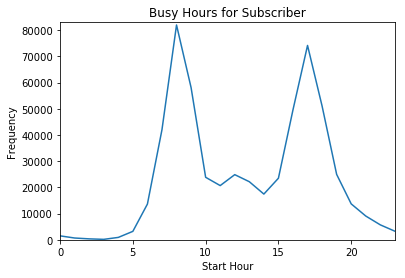

```python
# Importa todas as bibliotecas necessárias
%matplotlib inline
import csv
from datetime import datetime
import numpy as np
import pandas as pd
from IPython.display import display
```


## Dataset Bay Area Bike Share

[Bay Area Bike Share](http://www.bayareabikeshare.com/) é uma empresa que oferece aluguel de bicicletas on-demand para clientes em San Francisco, Redwood City, Palo Alto, Mountain View e San Jose. Os usuários podem desbloquear bicicletas de uma variedade de estações em cada cidade, e devolvê-las em qualquer estação dentro da mesma cidade. Os usuários pagam o serviço por meio de assinatura anual ou pela compra de passes de 3 dias ou 24 horas. Os usuários podem fazer um número ilimitado de viagens. Viagens com menos de trinta minutos de duração não têm custo adicional; Viagens mais longas incorrem em taxas de horas extras.

O análise dos dados foi realizada em 4 etapas:

1) Qual o objetivo da análise que está sendo realizada?

2) Limpeza dos Dados

3) Análise Explorátória

4) Visualização no Tableau


### ETAPA 1 - OBJETIVO

**OBJEIVO: ** O objetivo dessa análise é entender quais são as características e diferença entre os dois tipos de usuários, analisando os horários de picos, duração da locação e frequancia ao longo dos dias da semana.


### ETAPA 2 - Data Wrangling

Os dados coletados do site da empresa estavam divididos em 3 períodos de tempo ("201402", "201408", "201508"), onde para cada período existiam 3 arquivos:

- Informações sobre cada viagem ("..._trip_data.csv")
- Informações sobre as estações ("..._station_data.csv")
- Dados meteorológicos diários para cada cidade ("..._weather_data.csv")

Ao relizar o Data Wrangling, os dados foram tratados, selecionados e unificados em um único arquivo chamada: "trip_data.csv"

**OBS: **A limpeza de dados pode ser encotrada no arquivo "Data Wranling - ETAPA 2.ipynb" e foi enviado na submissão do projeto. 

Segue abaixo uma amostra do arquivo final:


```python
trip_data = pd.read_csv('trip_data.csv')

display(trip_data.head(20))
```


<div>
<style>
    .dataframe thead tr:only-child th {
        text-align: right;
    }

    .dataframe thead th {
        text-align: left;
    }

    .dataframe tbody tr th {
        vertical-align: top;
    }
</style>
<table border="1" class="dataframe">
  <thead>
    <tr style="text-align: right;">
      <th></th>
      <th>duration</th>
      <th>start_date</th>
      <th>start_year</th>
      <th>start_month</th>
      <th>start_hour</th>
      <th>weekday</th>
      <th>start_city</th>
      <th>end_city</th>
      <th>subscription_type</th>
    </tr>
  </thead>
  <tbody>
    <tr>
      <th>0</th>
      <td>1.050000</td>
      <td>29/08/2013</td>
      <td>2013</td>
      <td>8</td>
      <td>14</td>
      <td>3</td>
      <td>San Francisco</td>
      <td>San Francisco</td>
      <td>Subscriber</td>
    </tr>
    <tr>
      <th>1</th>
      <td>1.166667</td>
      <td>29/08/2013</td>
      <td>2013</td>
      <td>8</td>
      <td>14</td>
      <td>3</td>
      <td>San Jose</td>
      <td>San Jose</td>
      <td>Subscriber</td>
    </tr>
    <tr>
      <th>2</th>
      <td>1.183333</td>
      <td>29/08/2013</td>
      <td>2013</td>
      <td>8</td>
      <td>10</td>
      <td>3</td>
      <td>Mountain View</td>
      <td>Mountain View</td>
      <td>Subscriber</td>
    </tr>
    <tr>
      <th>3</th>
      <td>1.283333</td>
      <td>29/08/2013</td>
      <td>2013</td>
      <td>8</td>
      <td>11</td>
      <td>3</td>
      <td>San Jose</td>
      <td>San Jose</td>
      <td>Subscriber</td>
    </tr>
    <tr>
      <th>4</th>
      <td>1.383333</td>
      <td>29/08/2013</td>
      <td>2013</td>
      <td>8</td>
      <td>12</td>
      <td>3</td>
      <td>San Francisco</td>
      <td>San Francisco</td>
      <td>Subscriber</td>
    </tr>
    <tr>
      <th>5</th>
      <td>1.716667</td>
      <td>29/08/2013</td>
      <td>2013</td>
      <td>8</td>
      <td>18</td>
      <td>3</td>
      <td>San Francisco</td>
      <td>San Francisco</td>
      <td>Subscriber</td>
    </tr>
    <tr>
      <th>6</th>
      <td>1.816667</td>
      <td>29/08/2013</td>
      <td>2013</td>
      <td>8</td>
      <td>13</td>
      <td>3</td>
      <td>San Jose</td>
      <td>San Jose</td>
      <td>Subscriber</td>
    </tr>
    <tr>
      <th>7</th>
      <td>1.850000</td>
      <td>29/08/2013</td>
      <td>2013</td>
      <td>8</td>
      <td>14</td>
      <td>3</td>
      <td>San Jose</td>
      <td>San Jose</td>
      <td>Subscriber</td>
    </tr>
    <tr>
      <th>8</th>
      <td>1.883333</td>
      <td>29/08/2013</td>
      <td>2013</td>
      <td>8</td>
      <td>17</td>
      <td>3</td>
      <td>San Francisco</td>
      <td>San Francisco</td>
      <td>Subscriber</td>
    </tr>
    <tr>
      <th>9</th>
      <td>1.900000</td>
      <td>29/08/2013</td>
      <td>2013</td>
      <td>8</td>
      <td>11</td>
      <td>3</td>
      <td>San Jose</td>
      <td>San Jose</td>
      <td>Subscriber</td>
    </tr>
    <tr>
      <th>10</th>
      <td>2.083333</td>
      <td>29/08/2013</td>
      <td>2013</td>
      <td>8</td>
      <td>13</td>
      <td>3</td>
      <td>San Francisco</td>
      <td>San Francisco</td>
      <td>Subscriber</td>
    </tr>
    <tr>
      <th>11</th>
      <td>2.100000</td>
      <td>29/08/2013</td>
      <td>2013</td>
      <td>8</td>
      <td>13</td>
      <td>3</td>
      <td>San Jose</td>
      <td>San Jose</td>
      <td>Subscriber</td>
    </tr>
    <tr>
      <th>12</th>
      <td>2.150000</td>
      <td>29/08/2013</td>
      <td>2013</td>
      <td>8</td>
      <td>19</td>
      <td>3</td>
      <td>Mountain View</td>
      <td>Mountain View</td>
      <td>Subscriber</td>
    </tr>
    <tr>
      <th>13</th>
      <td>2.166667</td>
      <td>29/08/2013</td>
      <td>2013</td>
      <td>8</td>
      <td>13</td>
      <td>3</td>
      <td>San Francisco</td>
      <td>San Francisco</td>
      <td>Subscriber</td>
    </tr>
    <tr>
      <th>14</th>
      <td>2.233333</td>
      <td>29/08/2013</td>
      <td>2013</td>
      <td>8</td>
      <td>12</td>
      <td>3</td>
      <td>San Francisco</td>
      <td>San Francisco</td>
      <td>Subscriber</td>
    </tr>
    <tr>
      <th>15</th>
      <td>2.300000</td>
      <td>29/08/2013</td>
      <td>2013</td>
      <td>8</td>
      <td>16</td>
      <td>3</td>
      <td>San Francisco</td>
      <td>San Francisco</td>
      <td>Subscriber</td>
    </tr>
    <tr>
      <th>16</th>
      <td>2.350000</td>
      <td>29/08/2013</td>
      <td>2013</td>
      <td>8</td>
      <td>11</td>
      <td>3</td>
      <td>San Jose</td>
      <td>San Jose</td>
      <td>Subscriber</td>
    </tr>
    <tr>
      <th>17</th>
      <td>2.366667</td>
      <td>29/08/2013</td>
      <td>2013</td>
      <td>8</td>
      <td>12</td>
      <td>3</td>
      <td>San Francisco</td>
      <td>San Francisco</td>
      <td>Subscriber</td>
    </tr>
    <tr>
      <th>18</th>
      <td>2.366667</td>
      <td>29/08/2013</td>
      <td>2013</td>
      <td>8</td>
      <td>22</td>
      <td>3</td>
      <td>San Francisco</td>
      <td>San Francisco</td>
      <td>Subscriber</td>
    </tr>
    <tr>
      <th>19</th>
      <td>2.400000</td>
      <td>29/08/2013</td>
      <td>2013</td>
      <td>8</td>
      <td>22</td>
      <td>3</td>
      <td>San Francisco</td>
      <td>San Francisco</td>
      <td>Subscriber</td>
    </tr>
  </tbody>
</table>
</div>


### ETAPA 3 - Análise Exploratória

Nessa etapa, realizei uma exploração e algumas visuzalições buscando encontrar a resposta para o objetivo proposto. 

**Número Total de Viagens:**


```python
print 'O total de viagens realizadas nesse novo arquivo é de ', len(trip_data.index)
```

    O total de viagens realizadas nesse novo arquivo é de  669959
    

**Separando os dados pelo tipo de inscrição:** 


```python
#Separando por subscription_type


customer = trip_data[['duration', 'start_hour', 'weekday', 'subscription_type']][trip_data['subscription_type'] == 'Customer']
subscriber = trip_data[['duration', 'start_hour', 'weekday', 'subscription_type']][trip_data['subscription_type'] == 'Subscriber']

print "The type of variable 'customer' is ", type(customer)
print "The type of variable 'subscriber' is ", type(subscriber)
print '\n'

print customer.head()
print subscriber.head()
print '\n'

#print customer.tail()
#print subscriber.tail()
#print '\n'


#print len(list(subscriber.values)) 
#print len(list(customer.values))
#print '\n'
print 'O número de viagens realizadas é de ', len(subscriber.index), "para os usuários do tipo 'Subscriber' e ", len(customer.index), " para os usuários do tipo 'Cutomer'. Condizente com o valor total anteriormente encontrado."
```

    The type of variable 'customer' is  <class 'pandas.core.frame.DataFrame'>
    The type of variable 'subscriber' is  <class 'pandas.core.frame.DataFrame'>
    
    
        duration  start_hour  weekday subscription_type
    24  2.683333          10        3          Customer
    30  2.883333          11        3          Customer
    41  3.133333          19        3          Customer
    48  3.483333          17        3          Customer
    51  3.566667          17        3          Customer
       duration  start_hour  weekday subscription_type
    0  1.050000          14        3        Subscriber
    1  1.166667          14        3        Subscriber
    2  1.183333          10        3        Subscriber
    3  1.283333          11        3        Subscriber
    4  1.383333          12        3        Subscriber
    
    
    O número de viagens realizadas é de  566746 para os usuários do tipo 'Subscriber' e  103213  para os usuários do tipo 'Cutomer'. Condizente com o valor total anteriormente encontrado.
    

**Qual o start_hour de maior movimento?**


```python
#Definindo a função que retorna o start_hour de maior movimento
def busy_hour(data_file):
    #empty dict with all possibles start_hour
    start_hours = {0:int(), 1:int(), 2:int(), 3:int(), 4:int(), 5:int(), 6:int(), 7:int(), 8:int(), 9:int(), 10:int(), 11:int(), 12:int(),
                   13:int(), 14:int(), 15:int(), 16:int(), 17:int(), 18:int(), 19:int(), 20:int(), 21:int(), 22:int(), 23:int()}
    #print type(start_hours.keys()[0])
    for hour in data_file['start_hour']:
        start_hours[hour] += 1
    return start_hours
```


```python
#aplicando para os dois tipos de usuario
hours_subscriber = busy_hour(subscriber)
hours_customer = busy_hour(customer)
```

**Criando visualização dos horários de maior movimento para cada tipo de inscrição**


```python
#Usando matplot.pylab para plotar o comportamento e identificar os horários de maior movimento
import matplotlib.pyplot as plt
```

- **Para 'subscriber'**


```python
subscriber_x = hours_subscriber.keys()
subscriber_y = hours_subscriber.values()

print "O total de viagens ralizadas por usuários do tipo 'subscriber' é de ", sum(subscriber_y)

plt.plot(subscriber_x, subscriber_y)
plt.xlabel('Start Hour')
plt.ylabel('Frequency')
plt.title('Busy Hours for Subscriber')
plt.axis([0, 23, 0, 83000])

```

    O total de viagens ralizadas por usuários do tipo 'subscriber' é de  566746
    


    [0, 23, 0, 83000]





*Ánalise do Gráfico 'Busy Hours for Subscriber':*

    Podemos perceber que existem dois horários de grandes picos de movimento no caso do usuario 'subscriber'. O primeiro é no período entre as 7 e 9h e o segundo das entre as 16 e as 18h. Também há um pico menor aproximadamente as 12h.

- **Para 'customer'**


```python
customer_x = hours_customer.keys()
customer_y = hours_customer.values()

print  "O total de viagens ralizadas por usuários do tipo 'customer' é de ", sum(customer_y)

plt.plot(customer_x, customer_y)
plt.xlabel('Start Hour')
plt.ylabel('Frequency')
plt.title('Busy Hours for Customer')
plt.axis([0, 23, 0, 10000])
```

    O total de viagens ralizadas por usuários do tipo 'customer' é de  103213
    


    [0, 23, 0, 10000]


*Ánalise do Gráfico 'Busy Hours for Subscriber':*

    Podemos perceber que existem um único horário de grande movimento entre 12 e 17h.

**RESUMO ATÉ AQUI: **É possível observar que os diferentes tipos de usuários apresentam diferentes comportamento no que diz a respeito dos horários de urlização. Agora, a análise seguirá para análisar informações estatísticas BÁSICAS sobre a duração de seus viagens e dias de utlização, comparando a utilização em dias de semana e finais de semana. 

**Análise sobre a duração das viagens**


```python
# Para usuários 'subscriber' a análise será feita no intervalo de maior movimento, ou seja, 
#entre as 6 e as 9h. Intervalo definido com base no gráfico 'Busy Hours for Subscriber'.

#Filtrando pelo horário
subscriber_busy = subscriber[['duration', 'start_hour']][(subscriber['start_hour']>=7) & (subscriber['start_hour']<=9)]

#Estatistica com describe() function
print subscriber_busy['duration'].describe()

```

    count    182131.000000
    mean          9.517797
    std          36.072745
    min           1.000000
    25%           5.616667
    50%           8.083333
    75%          11.116667
    max       10322.033333
    Name: duration, dtype: float64
    


```python
# Para usuários 'customer' a análise será feita no intervalo de 7 a 22h, visto que existe 
#apenas um intervalo de maior movimento e já tão acentuado como no caso do 'subscriber'. 
#Intervalo definido com base no gráfico 'Busy Hours for Customer'.

#Filtrando pelo horário
customer_busy = customer[['duration', 'weekday', 'start_hour']][(customer['start_hour']>=7) & (customer['start_hour']<=22)]

##Estatistica com describe() function
customer_busy['duration'].describe()
```


    count     99353.000000
    mean         64.061153
    std         946.387841
    min           1.000000
    25%          10.983333
    50%          18.600000
    75%          38.600000
    max      287840.000000
    Name: duration, dtype: float64


*Análise dos dados estatísticos sobre a 'duration'*

Mesmo os desvios padrões apresentarem valores muito altos, devido a outlinears que não foram tratados, já é possível perceber outra caracteristíca em relação ao tipo de usuário. Os usuários do tipo 'customer' utilizam as bicicletas para trajetos curtos (menos de 30min) e os usuários do tipo 'subscriber' utilizam por as bicicletas por grandes períodos de duração.

**Análise dos dias da semana de maior utilização**

Para essa análise o objetivo é plotar os dias da semana e número de viagens realizadas para cada dia, comparando os dias de maior movimento para os dois tipos de usuários.


- **Para 'subscriber'**


```python
#Filtrando para um Pandas.Series com apenas os weeksdays
subscriber_weekday = subscriber['weekday']

#Criando um histograma que mostre a frequencia de utilização para cada dia da semana
subscriber_weekday.hist(range=(0,7), bins=7)
plt.xlim(0,7)
plt.ylim(0,120000)
plt.title('Weekday x Frequency - Subscriber ')
plt.xlabel('Weekdays')
plt.ylabel('Frequency')

```


    <matplotlib.text.Text at 0xdfe7ef0>


*Análise do Gráfico 'Weekday x Frequency - Subscriber':*

Queda abrupta de utilização dos serviços aos finais de semana.

- **Para 'customer'**


```python
#Filtrando para um Pandas.Series com apenas os weeksdays
customer_weekday = customer['weekday']

#Criando um histograma que mostre a frequencia de utilização para cada dia da semana
customer_weekday.hist(range=(0,7), bins=7)
plt.xlim(0,7)
plt.ylim(0,25000)
plt.title('Weekday x Frequency - Customer ')
plt.xlabel('Weekdays')
plt.ylabel('Frequency')

```


    <matplotlib.text.Text at 0xe31e7f0>


*Análise do Gráfico 'Weekday x Frequency - Customer':*

Aumento significativo de utilização do serviço aos finais de semana.

## ETAPA 4 - Visuzalição no Tableau

Após a análise exploratória dos dados, é possível criar uma história no Tableau para reportar o que foi encontrado.

### Links para os Workbooks do Tableau

- VERSÃO INICIAL: [Bay Area Bike Share: Subscriber x Customer](https://public.tableau.com/views/BayAreaBikeShareSubscriberxCustomer/BayAreaBikeShareSubscriberxCustomer?:embed=y&:display_count=yes&:toolbar=no)

- VERSÃO ATUALIZADA 1: [Bay Area Bike Share: Subscriber x Customer(ATUALIZADO)](https://public.tableau.com/views/BayAreaBikeShareSubscriberxCustomerATUALIZADO/BayAreaBikeShareSubscriberxCustomer?:embed=y&:display_count=yes&:toolbar=no)

- VERSÃO ATUALIZADA 2: [Bay Area Bike Share: Diferentes Comportamentos dos Usuários Subscriber e Customer](https://public.tableau.com/views/BayAreaBikeShareDiferentesComportamentosdosUsuriosSubscribereCustomer/BayAreaBikeShareDiferentesComportamentosdosUsuriosSubscribereCustomer?:embed=y&:display_count=yes&publish=yes&:toolbar=no)

- VERSÃO ATUALIZADA 3: [Bay Area Bike Share: Diferentes Comportamentos dos Usuários Subscriber e Customer](https://public.tableau.com/views/BayAreaBikeShareDiferentesComportamentosdosUsuriosSubscribereCustomeratualizado/BayAreaBikeShareDiferentesComportamentosdosUsuriosSubscribereCustomer?:embed=y&:display_count=yes&publish=yes&:toolbar=no)

### Resumo

A história criada evidencia os diferentes comportamentos dos usuários, onde os os usuários do tipo 'Subscriber' apresentam pico bem definidos nos horários de rotina de trabalho(8h, 12h, 18h), já os usuários do tipo 'Customer' não apresentam picos de movimento, apenas ocorre um aumento (em uma taxa bem menor) entre o período das 9h as 18h. 
Em relação ao tempo médio de uso constatou-se outra grande diferença, onde os usuários tipo 'Customer' realizam alugueis com grandes tempos de duração e os do tipo 'Subscriber' fazem o uso para pequenos deslocamentos. Quanto aos dias da semana de utilização os usuários do tipo 'Subscriber' utilizam o serviço predominantemente nos dias da semana. O oposto ocorre com os usuários do tipo 'customer'. Os usuários 'Subscriber' utilizam o serviço como locomoção no dia a dia, em suas rotinas e não como lazer. O oposto ocorre com os do tipo 'Customer' onde ocorre um aumento de utilização do serviço aos finais de semana, porém a diferença de número de usuários nos dias de semana não é tão diferente aos finais de semana (quando compardo com os usuários do tipo 'subscriber') portanto esse tipo de usuários devem ser turistas visto que a região é um grande ponto turístico.

### Design

Os dados que foram utilizados na visualização inicial foram:

- Tipo de usuário: dado categorico nominal
- Duração da locação: dado quantitativo contínuo
- Dia da semana: dado categórico ordinal (ordenado)
- Hora de início: variável discreta

Inicialmente, escolhi explicar do que se tratava os dados e qual o objetivo com a análise realizada.
Após deixar isso claro, achei interessantes começar mostrando uma das análises exploratórias que realizei quando tive o primeiro contato com os dados. Mostrei a proporção entre cada tipo de usuário para um entendimento mais geral, e não menos importante, sobre os dados. 

Após essa introdução, iniciei a análise explanatória dos dados. Mostrei o comportamento dos dois tipos de usuários para três parâmetros diferentes (hora de início, duração e frequência de utilização ao longo dos dias da semana).

OBS: Cores para cada tipo de usuário facilitam a identificação e foram utilizadas azul para os usuários 'customer' e laranja para os usuários 'subscriber' para todos os gráficos, criando um padrão para todo o projeto.


1) Para mostrar os horários de pico de utilização do serviço plotei um gráfico de linha (eixo duplo) comparando os usuários. Mesmo nos dados a hora de início ser classificado apenas como valores inteiros, utilizei o gráfico de linha para enfatizar o padrão geral dos usuários e plotei os dos usuários em um único gráfico, com diferentes cores, para facilitar a comparação.

2) Para evidenciar a diferença entre a média de duração entre os usuários, utilizei o gráfico de baras por ser simples e objetivo para mostrar essa diferença. Cores auxiliam na comparação. 

3) Visando comprar o comportamento dos dois usuários ao longo dos dias da semana, e como os dias da semana são dados categóricos, escolhi novamente o gráfico de barras, mas dessa vez preferi utilizar dois gráficos, pois não queria comprar os valores (barra dupla para cada dia da semana em um único gráfico), gostaria de evidenciar a diferença de comportamento entre os dois usuários. Aqui, coloquei os títulos dos gráficos na cores padrão de cada tipo de usuário para facilitar a associação do usuário e manter o pdrão. Usei as mesmas cores para identificar os dias da semana nos dois gráficos (única legenda para os dois gráficos) e inseri 'actions' para facilitar a comparação e melhorar a experiência de quem está visualizando a história.

Após evidenciar as diferenças encontradas, fui em busca de concluir para unir as infomações encontradas.
Com isso, criei uma única visualização com todas as 3 visualizações explanatórias e criei iteratividade entre elas visando destadar todos os dados de cada tipo de usuários, bem como comprar os dias da semana. 
Por fim, coloquei um texto conclusivo para o fechamento da ideia encontrada. Caracterizei os dois diferentes tipo de usuários e seus custumes com base nos dados do aluguel das bicicletas.

**JUSTIFICATIVA SOBRE AS CORES ESCOLHIDA**

Sobre a cor azul para os usuário do tipo Customer e a cor laranaja para os usuários do tipo Subscriber, escolhi duas cores sólidas e de grande contraste, visto que são categorias (qualitativos) e eu buscava deixar claro a separação ao longo de todas as visualizações do projeto. Essas cores foram adotadas como padrão para a história inteira. Além do que essas cores não causam problemas para pessoas com Daltonismo. 

Agora, em relação as cores utilizadas para os dias da semana, como são dados qualitativos, eu usei uma paleta qualitativa. Com isso, eu busquei escolher as cores com mais contrate entre elas, visando deixar claro quais eram os dias da semana de cada coluna. A pelata escolhida foi:


** APÓS COLETA DOS FEEDBACKs **

Foram realizadas 04 mudanças:

1ª) Correção no texto da visuzalização sobre a média de duração sobre das viagens. 

2ª) Mesmo com os eixos mostrando os valores na visualização sobre os dias da semana, existe tendência em achar que o número de viagens para o grupo Subscriber é maior, portanto foi esclarecido isso em o forma de texto nesse slide.

3ª) Foram alteradas algumas palavras repetidas.

4ª) Melhora na localização do texto da vsuzalição osbre a frequência de utlização ao longo do semana. 

** APÓS REVISÃO 1 DO UDACITY **

Foram realizadas as seguintes mudanças:

1) Legendas foram alteradas para serem explicativas e não perguntas.

2) Foram destacados alguns pontos específicos dos horários de pico.

3) O Resumo foi alterado para descrever de forma clara o achado que ser quer demonstrar com a visualização.

4) Alteração da classificação da variável "Hora de Início" para discreta

5) O título foi altarado para ser mais representativo sobre a análise realizada.

** APÓS REVISÃO 2 DO UDACITY **

Foram realizadas as seguintes mudanças:

1) O eixo dos gráficos foram renomeados para melhor representar os dados, adicionando-se as unidades das medidas.

2) Os pontos em destaques também sofreream alteração de descrição de acordo com os eixos.

3) O espaço para a legenda dos dias da semana foi aumentado para que o nome dos dias da semana sejam exibidos completos.

4) Foi adicionado justificativa sobre a escolha da paleta e suas cores.

### Comentários (Feedback)

Abaixo seguem cópias dos feedbacks que recebi:

"Achei a visualização bem organizada, não há coisas desnecessárias nos slides, apenas informações concisas e importantes. Ali em "Média de duração das viagens" vc confundiu os tipos de costumers no texto! A conclusão é a mesma que vc tirou, até pq o Subscriber deve ser mais barato no final das contas, então esse é o tipo de gente que usa no dia a dia mesmo. Consegui entender tudo, bem feita Hugo! Só cuidado com a repetição de palavras no texto." 

"Pela visualização dos gráficos percebe-se que a categoria Subscriber tem uma maior demanda em todas as variaveis avaliadas, inclusive na frequencia ao longo da semana, onde a visualização dos gráficos levam-nos acreditar que nos finais de semana a demanda da categoria cutomer é maior. O que não é verdade, comparando os dois grupos de usuarios nos finais de semana, constatamos uma diferença insignificante.
A categoria subscriber  relaciona com usuários que utilizam tal meio de transporte para sua locomoção diária. E a categoria customer relaciona com usuários que utilizam esporadicamente, como lazer por exemplo. 
A principal conclusão é a predominância da categoria Subscriber. E se alguma tomada estratégica for tomada, que seja centrada nesse grupo. Não há algo que não entenda, somente o detalhe visual da comparação entre os dois grupos na variável 'frequencia ao longo da semana', que nos fazem acreditar que o numero de usuariaos da classe customer é bem maior do que a classe Subscriber.Outro ponto observado foi que um gráfico que esta com os tipos de usuarios trocados esta descrito que os usuários customer realiza trajetos de curta duração porem a barra do gráfico esta maior."

"Oi @hugo_saito, gostei da sua apresentação baseada no Trabalho Final do Data Science I. O Estudo de comportamento entre os dois tipos de usuários, seus horários de pico de utilização, bem como o comportamento nos dias da semana estão bastante claros. O única coisa são as escritas que você fez, as vezes elas estão encobrindo o gráfico. EU tentaria melhorar a apresentação neste sentido… De resto, gostei muito da apresentação"

"Também gostei muito da apresentação! Assim como o Ademar comentou acima, só mudaria a parte da escrita na parte que você fala da frequência. Poderia colocar mais parecido com o que você fez na parte de horários de maior número de locação."


### Recursos

Segue abaixo links que contribuiram para a conclusão do projeto:

- https://onlinehelp.tableau.com/current/pro/desktop/en-us/publish_workbooks_tableaupublic.html
- https://www.tableau.com/learn/tutorials/on-demand/dashboard-interactivity-using-actions?product=&version=10.3&topic=dashboardsstories
-http://onlinehelp.tableau.com/current/pro/desktop/en-us/help.htm#dashboards.html%3FTocPath%3DPresent%2520Your%2520Work%7CDashboards%7C_____0
- http://www.perceptualedge.com/articles/misc/Graph_Selection_Matrix.pdf
- http://www.perceptualedge.com/articles/ie/the_right_graph.pdf


```python

```
